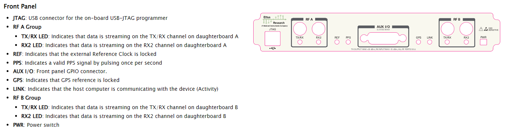
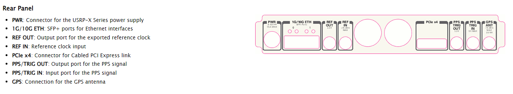
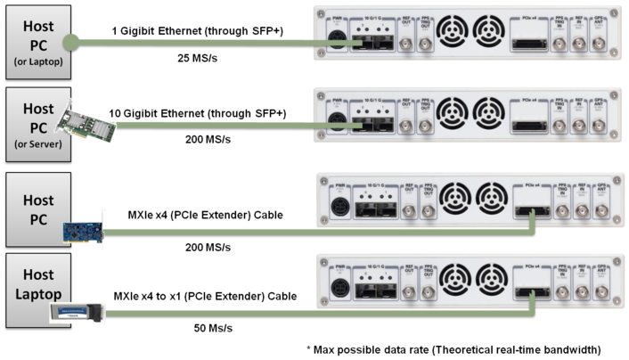
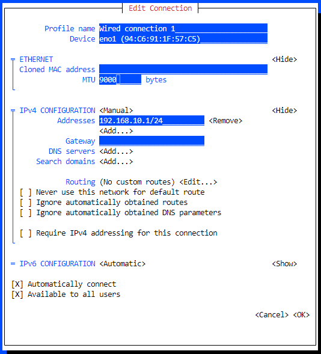

<!-- Improved compatibility of back to top link: See: https://github.com/othneildrew/Best-README-Template/pull/73 -->
<a name="readme-top"></a>

<!-- GETTING STARTED -->
## Getting Started

### Documentation and associated links

This is an example of how to list things you need to use the software and how to install them.
* Ettus USRP x310 Manual: https://files.ettus.com/manual/page_usrp_x3x0.html
* Ettus x310 Knowledge Base: https://kb.ettus.com/X300/X310
* Ettus USRP Github: https://github.com/EttusResearch/uhd
* Verifying Operations: https://kb.ettus.com/Verifying_the_Operation_of_the_USRP_Using_UHD_and_GNU_Radio
* PySDR: https://pysdr.org/content/usrp.html
* USRP & MATLAB: https://www.mathworks.com/hardware-support/usrp.html
* UHD Python API: https://kb.ettus.com/UHD_Python_API 
* Places to look for help: https://kb.ettus.com/StackExchange 
* Generate spectrograms from received signal: https://stackoverflow.com/questions/78076552/how-can-i-generate-detect-signals-2-4ghz-and-generate-spectrograms-from-them-l


### Installation
1. Install necessary components to build from source:
    ```sh
    sudo apt-get install git cmake libboost-all-dev libusb-1.0-0-dev python3-docutils python3-mako python3-numpy python3-requests python3-ruamel.yaml python3-setuptools build-essential
    ```
2. Clone the repo
   ```sh
    cd ~/ && mkdir git && cd git
    git clone https://github.com/EttusResearch/uhd.git
   ```
3. Build from source
   ```sh
   cd uhd/host
   mkdir build
   cd build
   cmake -DENABLE_TESTS=OFF -DENABLE_C_API=OFF -DENABLE_PYTHON_API=ON -DENABLE_MANUAL=OFF ..
   make -j8
   sudo make install
   sudo ldconfig
   ```
4. Test the drivers and imports in python REPL (assuming IP configuration has been completed)
   ```python3
    import uhd
    usrp = uhd.usrp.MultiUSRP()
    samples = usrp.recv_num_samps(10000, 100e6, 1e6, [0], 50)
    print(samples[0:10])quit()
    ```

    * Expect to see the following as an output:
        ```sh
        >>> print(samples[0:10])
        [[0.        +0.000000e+00j 0.        +0.000000e+00j
        0.        +0.000000e+00j ... 0.00039674+9.155553e-05j
        0.00027467-6.103702e-05j 0.00027467+3.051851e-05j]    
        ```

<p align="right">(<a href="#readme-top">back to top</a>)</p>


## HW Overview
Front Panel:
* **<u>Ensure that before transmitting that the TX port is terminated either with a load or to an antenna.</u>**
* Note RF A & RF B Ports both of which have a TX/RX port as well as RX2 ports.  I believe this is a shared LO so while we can do 2x2 RX MIMO, this will need to be on the same frequency.  
    

Rear Panel:
* Note 1G/10G Eth interfaces.  For each you will need either an SFP or 10GigE Interface Kit
    


    

<p align="right">(<a href="#readme-top">back to top</a>)</p>

## Host System Configuration
There are two possible connections to the SDR from a host machine either 1G copper or 10G optical with limited bandwidth dependent on interface connections.,  To utilize the 1G connection use Port0, while 10G can either be used on Port0 or Port1.
### IP Assignments
Host address for connectivity between interfaces requires a different subnet
* Port 0 - 1G: 192.168.10.1/24 - SDR will have a pre-assigned 192.168.10.2 address
* POrt 0 - 10G: 192.168.30.1/24 - SDR will have a pre-assigned 192.168.30.2 address
* Port 1 - 10G: 192.168.40.1/24 - SDR will have a pre-assigned 192.168.40.2 address

### Network Buffers
* Set UDP Buffer Size as follows.  The first option is temporary and will not be retained after a restart
```sh
   sudo sysctl -w net.core.wmem_max=33554432
   sudo sysctl -w net.core.rmem_max=33554432
   sudo sysctl -w net.core.wmem_default=33554432
   sudo sysctl -w net.core.rmem_default=33554432
```
* On an Ubuntu 22.04 system, you can make this change persistent by creating a file in sysctl.d (/etc/systctl.d/100-usrp-perf.conf).  This file should contain:
```sh
   net.core.wmem_max=33554432
   net.core.rmem_max=33554432
   net.core.wmem_default=33554432
   net.core.rmem_default=33554432
```
* Validation can be performed with `sudo sysctl -a |egrep -i '(net.core.r|net.core.w)'`

### Ethernet MTU
* MTU should be manually fixed.  Non-permanently, this can be performed by using the following command `sudo ip link set <interface> mtu <MTU>`

    * If using the 1G ethernet interface, it is advisable to fix MTU to 1500
    * Set the MTU to 9000 when using the 10G connection 

* A more permanent solution will be to manually configure via GUI or using nmtui as shown below:
    

* Validation can be performed with `ip link show <interface>`

<p align="right">(<a href="#readme-top">back to top</a>)</p>

## Firmware
### Firmware Loader
* You may run into a situation where the firmware does not match expected.  This can also happen if you switch between 1G/10G interfaces.  An example can be seen below to upgrade:
* **Note: A reboot of the SDR is required after firmware upgrade**
```sh
[INFO] [X300] X300 initialization sequence...
Error: RuntimeError: Expected FPGA compatibility number 39.0, but got 38.0:
```
```sh
noaa_gms@noaa-gms-server0:~/git/usrp_sdr$ "/usr/local/bin/uhd_image_loader" --args="type=x300,addr=192.168.10.2"
[INFO] [UHD] linux; GNU C++ version 11.4.0; Boost_107400; UHD_4.6.0.0-166-g041eef34
Unit: USRP X310 (31E0CA7, 192.168.10.2)
FPGA Image: /usr/local/share/uhd/images/usrp_x310_fpga_HG.bit
-- Initializing FPGA loading...successful. 
-- Loading HG FPGA image: 100% (121/121 sectors)
-- Finalizing image load...successful.
Power-cycle the USRP X310 to use the new image.
```

### Firmware Updates
* To update local images you can use the following command to update the /usr/local/share/uhd/images folder:
```sh
    args="type=x300,addr=192.168.10.2"
```

<p align="right">(<a href="#readme-top">back to top</a>)</p>

## Usage and basic validation 
### Probing the device to validate internals
```sh
        noaa_gms@noaa-gms-server0:~$ uhd_usrp_probe --args addr=192.168.10.2 
        [INFO] [UHD] linux; GNU C++ version 11.3.0; Boost_107400; UHD_4.1.0.5-0-unknown
        [INFO] [X300] X300 initialization sequence...
        [INFO] [X300] Maximum frame size: 1472 bytes.
        [INFO] [X300] Radio 1x clock: 200 MHz
        _____________________________________________________
        /
        |       Device: X-Series Device
        |     _____________________________________________________
        |    /
        |   |       Mboard: X310
        |   |   revision: 11
        |   |   revision_compat: 7
        |   |   product: 30818
        |   |   mac-addr0: 00:80:2f:30:dd:e2
        |   |   mac-addr1: 00:80:2f:30:dd:e3
        |   |   gateway: 192.168.10.1
        |   |   ip-addr0: 192.168.10.2
        |   |   subnet0: 255.255.255.0
        |   |   ip-addr1: 192.168.20.2
        |   |   subnet1: 255.255.255.0
        |   |   ip-addr2: 192.168.30.2
        |   |   subnet2: 255.255.255.0
        |   |   ip-addr3: 192.168.40.2
        |   |   subnet3: 255.255.255.0
        |   |   serial: 31E0CA7
        |   |   FW Version: 6.0
        |   |   FPGA Version: 38.0
        |   |   FPGA git hash: 26793b8
        |   |   
        |   |   Time sources:  internal, external, gpsdo
        |   |   Clock sources: internal, external, gpsdo
        |   |   Sensors: ref_locked
        |     _____________________________________________________
        |    /
        |   |       RFNoC blocks on this device:
        |   |   
        |   |   * 0/DDC#0
        |   |   * 0/DDC#1
        |   |   * 0/DUC#0
        |   |   * 0/DUC#1
        |   |   * 0/Radio#0
        |   |   * 0/Radio#1
        |   |   * 0/Replay#0
        |     _____________________________________________________
        |    /
        |   |       Static connections on this device:
        |   |   
        |   |   * 0/SEP#0:0==>0/DUC#0:0
        |   |   * 0/DUC#0:0==>0/Radio#0:0
        |   |   * 0/Radio#0:0==>0/DDC#0:0
        |   |   * 0/DDC#0:0==>0/SEP#0:0
        |   |   * 0/Radio#0:1==>0/DDC#0:1
        |   |   * 0/DDC#0:1==>0/SEP#1:0
        |   |   * 0/SEP#2:0==>0/DUC#1:0
        |   |   * 0/DUC#1:0==>0/Radio#1:0
        |   |   * 0/Radio#1:0==>0/DDC#1:0
        |   |   * 0/DDC#1:0==>0/SEP#2:0
        |   |   * 0/Radio#1:1==>0/DDC#1:1
        |   |   * 0/DDC#1:1==>0/SEP#3:0
        |   |   * 0/SEP#4:0==>0/Replay#0:0
        |   |   * 0/Replay#0:0==>0/SEP#4:0
        |   |   * 0/SEP#5:0==>0/Replay#0:1
        |   |   * 0/Replay#0:1==>0/SEP#5:0
        |     _____________________________________________________
        |    /
        |   |       TX Dboard: 0/Radio#0
        |   |   ID: UBX-160 v2 (0x007d)
        |   |   Serial: 31D568D
        |   |     _____________________________________________________
        |   |    /
        |   |   |       TX Frontend: 0
        |   |   |   Name: UBX TX
        |   |   |   Antennas: TX/RX, CAL
        |   |   |   Sensors: lo_locked
        |   |   |   Freq range: 10.000 to 6000.000 MHz
        |   |   |   Gain range PGA0: 0.0 to 31.5 step 0.5 dB
        |   |   |   Bandwidth range: 160000000.0 to 160000000.0 step 0.0 Hz
        |   |   |   Connection Type: QI
        |   |   |   Uses LO offset: No
        |     _____________________________________________________
        |    /
        |   |       RX Dboard: 0/Radio#0
        |   |   ID: UBX-160 v2 (0x007e)
        |   |   Serial: 31D568D
        |   |     _____________________________________________________
        |   |    /
        |   |   |       RX Frontend: 0
        |   |   |   Name: UBX RX
        |   |   |   Antennas: TX/RX, RX2, CAL
        |   |   |   Sensors: lo_locked
        |   |   |   Freq range: 10.000 to 6000.000 MHz
        |   |   |   Gain range PGA0: 0.0 to 31.5 step 0.5 dB
        |   |   |   Bandwidth range: 160000000.0 to 160000000.0 step 0.0 Hz
        |   |   |   Connection Type: IQ
        |   |   |   Uses LO offset: No
        |     _____________________________________________________
        |    /
        |   |       TX Dboard: 0/Radio#1
        |   |   ID: UBX-160 v2 (0x007d)
        |   |   Serial: 31D5708
        |   |     _____________________________________________________
        |   |    /
        |   |   |       TX Frontend: 0
        |   |   |   Name: UBX TX
        |   |   |   Antennas: TX/RX, CAL
        |   |   |   Sensors: lo_locked
        |   |   |   Freq range: 10.000 to 6000.000 MHz
        |   |   |   Gain range PGA0: 0.0 to 31.5 step 0.5 dB
        |   |   |   Bandwidth range: 160000000.0 to 160000000.0 step 0.0 Hz
        |   |   |   Connection Type: QI
        |   |   |   Uses LO offset: No
        |     _____________________________________________________
        |    /
        |   |       RX Dboard: 0/Radio#1
        |   |   ID: UBX-160 v2 (0x007e)
        |   |   Serial: 31D5708
        |   |     _____________________________________________________
        |   |    /
        |   |   |       RX Frontend: 0
        |   |   |   Name: UBX RX
        |   |   |   Antennas: TX/RX, RX2, CAL
        |   |   |   Sensors: lo_locked
        |   |   |   Freq range: 10.000 to 6000.000 MHz
        |   |   |   Gain range PGA0: 0.0 to 31.5 step 0.5 dB
        |   |   |   Bandwidth range: 160000000.0 to 160000000.0 step 0.0 Hz
        |   |   |   Connection Type: IQ
        |   |   |   Uses LO offset: No
```
 
<p align="right">(<a href="#readme-top">back to top</a>)</p>

### Benchmarking
* Benchmark (Using the 1G port and configured sysctl params you can expect a maximum of 28.571Msps before overruns occur)
    ```sh
    python /usr/lib/uhd/examples/python/benchmark_rate.py --rx_rate 56e6 --args "num_recv_frames=1000"
    ```
    * Below is an example of observed overruns witw overruns shown as 'O' below
    ```sh
    noaa_gms@noaa-gms-server0:~/git/usrp_sdr$ python3 /usr/lib/uhd/examples/python/benchmark_rate.py --rx_rate 31e6 --args "num_recv_frames=1000"
    [INFO] [UHD] linux; GNU C++ version 11.3.0; Boost_107400; UHD_4.1.0.5-0-unknown
    [INFO] [X300] X300 initialization sequence...
    [INFO] [X300] Maximum frame size: 1472 bytes.
    [INFO] [X300] Radio 1x clock: 200 MHz
    [WARNING] [UDP] The current recv_buff_size of 2426666 is less than the minimum recommended size of 9600000 and may result in dropped packets on some NICs
    [16:52:51.95] [INFO] (MainThread) Using Device: Single USRP:
    Device: X-Series Device
    Mboard 0: X310
    RX Channel: 0
        RX DSP: 0
        RX Dboard: A
        RX Subdev: UBX RX
    RX Channel: 1
        RX DSP: 1
        RX Dboard: B
        RX Subdev: UBX RX
    TX Channel: 0
        TX DSP: 0
        TX Dboard: A
        TX Subdev: UBX TX
    TX Channel: 1
        TX DSP: 1
        TX Dboard: B
        TX Subdev: UBX TX

    [16:52:51.95] [INFO] (MainThread) Selected [0] RX channels and no TX channels
    [16:52:51.95] [INFO] (MainThread) Setting device timestamp to 0...
    [WARNING] [MULTI_USRP] Could not set RX rate to 31.000 MHz. Actual rate is 33.333 MHz
    [WARNING] [MULTI_USRP] Could not set RX rate to 31.000 MHz. Actual rate is 33.333 MHz
    [WARNING] [UDP] The current recv_buff_size of 2426666 is less than the minimum recommended size of 9600000 and may result in dropped packets on some NICs
    [16:52:51.96] [INFO] (Thread-1 (benchmark_rx_rate)) Testing receive rate 33.333 Msps on 1 channels
    /usr/lib/uhd/examples/python/benchmark_rate.py:436: DeprecationWarning: setName() is deprecated, set the name attribute instead
    rx_thread.setName("bmark_rx_stream")
    OOOOOOOOOOOOOOOOOOOOOOOOOOOOOOOOOOOOOOOOOOOOOOOOOOOOOOOOOOOOOOOOOOOOOOOOOOOOOOOOOOOOOOOOOOOOOOOOOOOOOOOOOOOOOOOOOOOOOOOOOOOOOOOOOOOOOOOOOOOOOOOOOOOOOOOOOOOOOOOOOOOOOOOOOOOOOOOOOOO[16:53:01.97] [DEBUG] (MainThread) Sending signal to stop!
    [16:53:01.97] [DEBUG] (MainThread) RX Statistics Dictionary: {'num_rx_samps': 12885535, 'num_rx_dropped': 304064779, 'num_rx_overruns': 179, 'num_rx_seqerr': 0, 'num_rx_timeouts': 0, 'num_rx_late': 0}
    [16:53:01.97] [DEBUG] (MainThread) TX Statistics Dictionary: {}
    [16:53:01.98] [DEBUG] (MainThread) TX Async Statistics Dictionary: {}
    [16:53:01.98] [INFO] (MainThread) Benchmark rate summary:
        Num received samples:     12885535
        Num dropped samples:      304064779
        Num overruns detected:    179
        Num transmitted samples:  0
        Num sequence errors (Tx): 0
        Num sequence errors (Rx): 0
        Num underruns detected:   0
        Num late commands:        0
        Num timeouts (Tx):        0
        Num timeouts (Rx):        0
    ```  